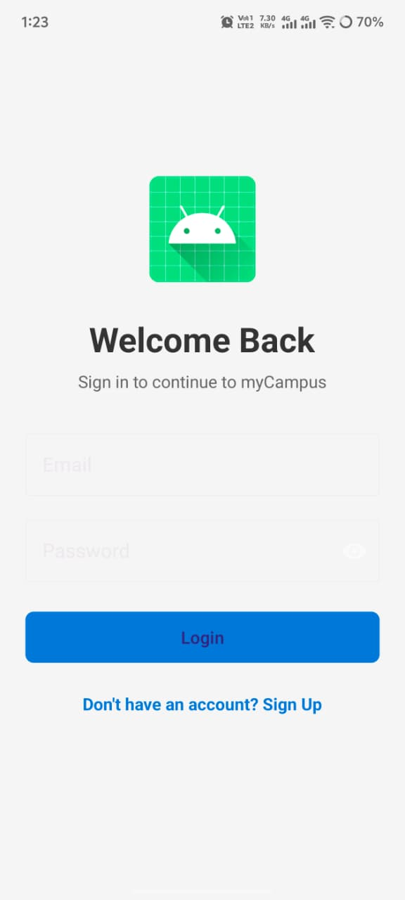
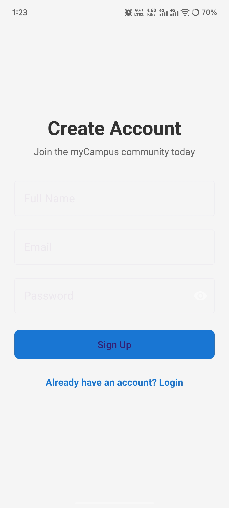
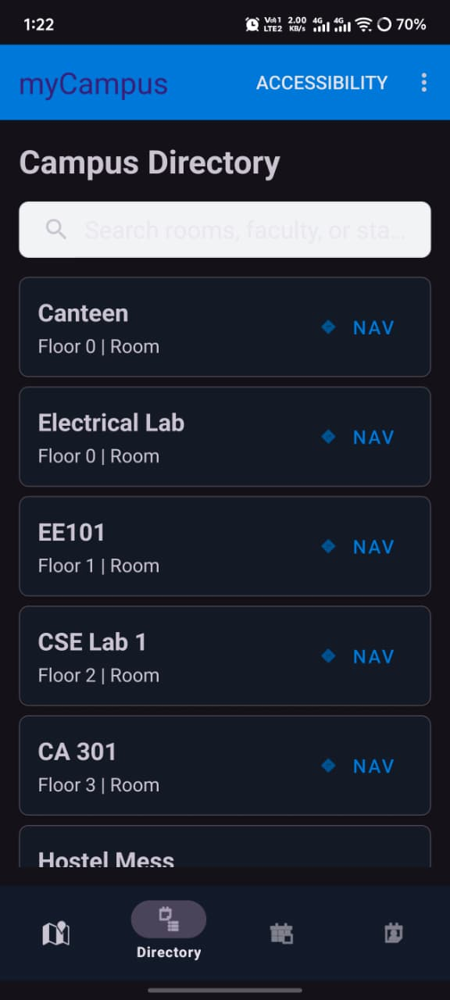
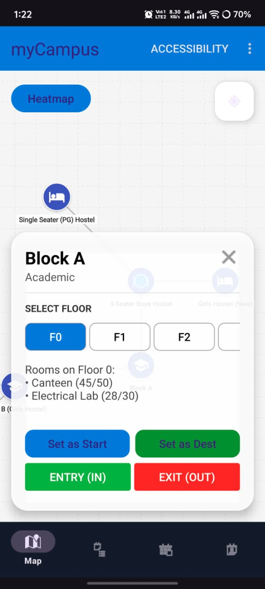
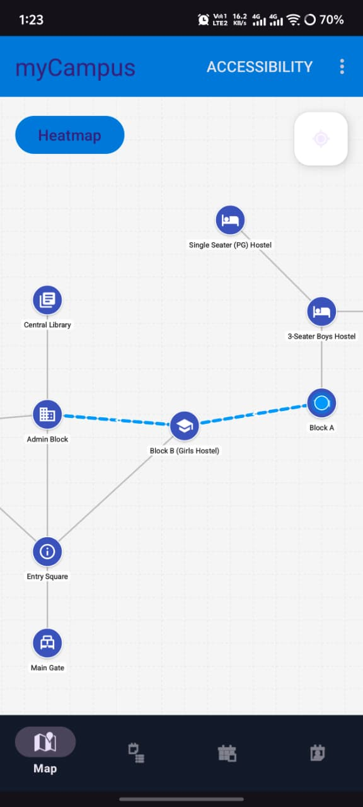
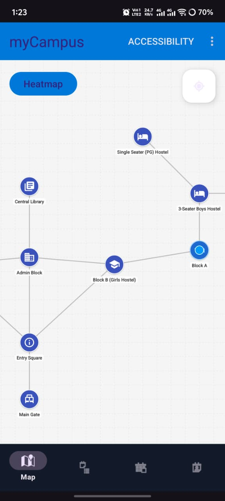
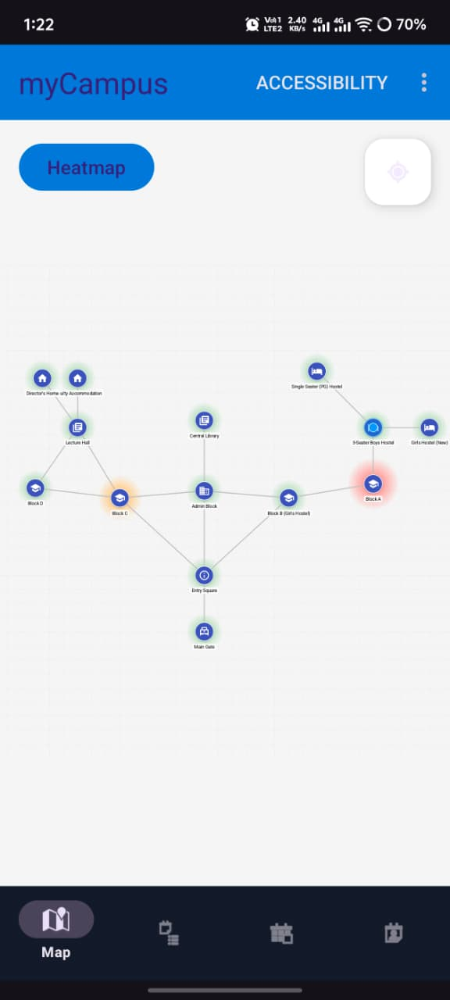
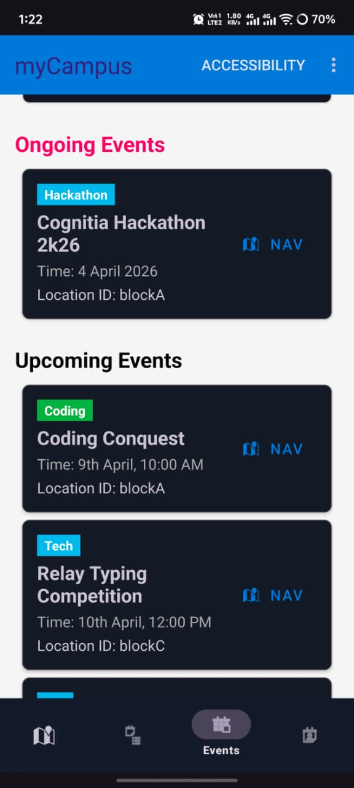
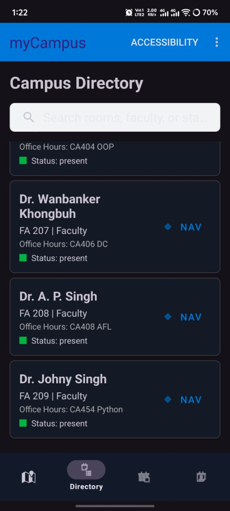
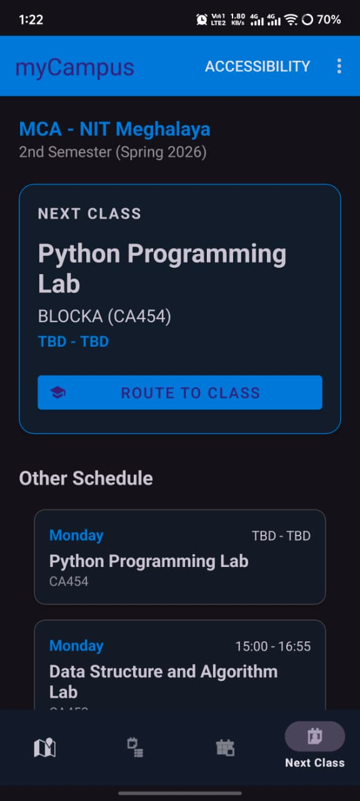

# 🚀 Campus Flow Optimizer

> 🚀 Smart navigation + real-time room intelligence for large campuses
> *"Find rooms, track availability, and navigate effortlessly"*


---

## 📌 Problem Statement

In large campuses, students frequently waste time:

* Searching for classrooms, labs, or faculty cabins
* Checking whether rooms are free or occupied
* Navigating complex building layouts
* Finding ongoing events or faculty availability

This inefficiency leads to confusion, delays, and reduced productivity.

---

## 🎯 Why This Matters

Even a **5–10 minute delay per class** accumulates into significant productivity loss over time.
A smart system that reduces navigation friction can **dramatically improve campus efficiency and student experience**.

---

## 💡 Solution

**Campus Flow Optimizer** provides a centralized platform that integrates:

* 🗺️ Real-time navigation
* 📊 Smart room availability tracking
* 👨‍🏫 Faculty presence insights
* 📢 Event discovery

All in one intuitive mobile application.

---

## ✨ Key Features

### 🔹 Core Features

* 🗺️ **Interactive Campus Map**
  Buildings, floors, rooms, and facilities

* 📊 **Room Availability Status**

  * Occupied
  * Free
  * Upcoming classes

* 🔍 **Smart Search**

  * Classrooms
  * Labs
  * Faculty rooms
  * Admin offices

* 📍 **Step-by-Step Navigation**
  Optimized path to any campus location

* 👨‍🏫 **Faculty Availability Indicator**

  * Present
  * In class
  * Unavailable

* 📢 **Event & Announcement Board**
  Ongoing and upcoming events with mapped locations

---

### ⭐ Advanced Features

* 🔥 **Crowd Density Heatmap**
* 🧭 **"Find Me a Free Room"** smart suggestion
* ⏰ **Timetable Integration + Smart Reminders**
* ♿ **Accessible Route Navigation (No stairs)**
* 📱 **QR-Based Real-Time Occupancy Updates**

---

## 🛠️ Tech Stack

* **Platform:** Android
* **Language:** Java / Kotlin
* **UI:** XML / Jetpack Compose
* **Backend:** Firebase Authentication & Firestore *(update if different)*
* **Database:** Firebase Realtime DB / SQLite
* **Maps:** Google Maps API

---

## 📱 Screenshots

### 🔐 Authentication

<p align="center">
  
  
</p>

### 🗺️ Navigation & Map

<p align="center">
  
  
  
</p>

### 📍 Smart Features

<p align="center">
  
  
</p>

### 📊 Information & Insights

<p align="center">
  
  
  
</p>

---

## 🎥 Demo Video

[▶️ Watch Demo](https://drive.google.com/file/d/1mAsk_7ZuZSPJsPAxgxOKGhDaFVcyzGOG/view?usp=drivesdk)

---

## ⚙️ Installation

```bash
git clone https://github.com/nihaltiwari01/MyCampus.git
```

### Steps:

1. Open in Android Studio
2. Sync Gradle
3. Run on Emulator or Physical Device

---

## 🧠 How It Works

* Uses map-based visualization to represent campus layout
* Integrates scheduling data to determine room availability
* Provides shortest-path navigation between locations
* Displays real-time insights for better decision-making

---

## 🚀 Future Enhancements

* AI-based route optimization
* Indoor navigation using BLE/WiFi positioning
* Real-time crowd tracking using IoT/sensors
* Voice-assisted navigation

---

## 👨‍💻 Author

**Nihal Tiwari**
🔗 GitHub: https://github.com/nihaltiwari01

---

## 📜 License

This project is licensed under the MIT License.
